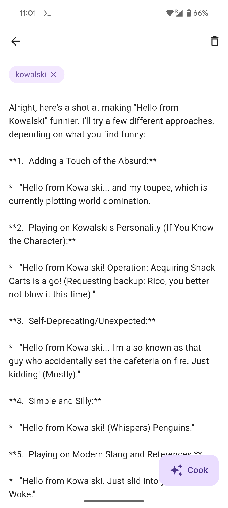

  

# kowalski

`kowalski` is an AI-powered [PKMS](https://www.reddit.com/r/PKMS/comments/1ae7spf/what_is_pkm/?tl=it) for Android based on [kowalski-core](https://github.com/Zatfer17/kowalski-core).

## Feature matrix

|                | kowalski | Keep | Obsidian | Notion | Anytype | Logseq | gitJournal | MyMind | Fabric |
|----------------|----------|------|----------|--------|---------|--------|------------|--------|--------|
| Free           | ✅        | ✅    | ✅        | ✅      | ✅       | ✅      | ✅          | ✅      | ✅      |
| Open source    | ✅        |      |          |        |         | ✅      | ✅          |        |        |
| Simple         | ✅        | ✅    |          |        |         |        | ✅          |        |        |
| Local          | ✅        |      |          |        |         | ✅      | ✅          |        |        |
| Plain markdown | ✅        |      | ✅        |        |         |        | ✅          |        |        |
| AI capable     | ✅        |      | ✅*       | ✅      |         | ✅*     |            | ✅      | ✅      |
| Cross platform | ✅*       | ✅    | ✅        | ✅      | ✅       | ✅      | ✅          | ✅      | ✅      |
| Hackable       | ✅        |      | ✅        |        |         |        |            |        |        |

*: With plugins

## License

`kowalski` is distributed under the terms of the [Creative Commons Zero Universal](https://creativecommons.org/publicdomain/zero/1.0/deed.en).
